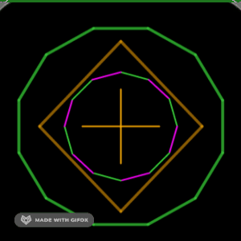

# fitbit-geometrix-JS

## work in progress
Widget to create (dynamic) regular polygons in fitbit OS (useless, but fun)

\
As I didn't find a way to get a "closed" object (only OWN properties) with the abstract settings and the approach from the fitbit-widget-template, I now decided to mod the widget-constructing process a bit:
\
Instead of returning `<useEl>`, I now create/return a widgetObject and construct this in `<app/index>` wrapping the `<useEl>`.

\
I haven't tested yet, if that step might compromise safety of the widget itself or the widget-factory.
\
After a thorough testing, I'll complete description, and perhaps add another type for progress-displaying in dynamic polygons.
\
(I am just 'fishing in muddy waters' and ever again astonished, when things work somehow. So any criticism is highly appreciated 🙂)

`THIS APPROACH CURRENTLY DOES NOT SUPPORT ANY CSS ON THE CONFIG-ATTRIBUTES!!`
<!--  -->
(looking for ideas to solve that, but perhaps not possible, as they don't have another corresponding SVG-Element then config.text itself?) In branch testCSS I added <config> to object and <parseConfig>into the setter, but still not applied if set in styles.css text-buffer - at least unnecessarily working from app/index.js ;)

Testing ...

\
.

## Acknowledgement
This widget uses a version of [Gondwana's widget-factory](https://github.com/gondwanasoft/fitbit-simple-widget) including `config` which provides an easy access to properties of the `<use>` and its children in `SVG` and/or `CSS`.\
To create your own widget have a look at [Gondwana's fitbit-widget-template](https://github.com/gondwanasoft/fitbit-widget-template).

